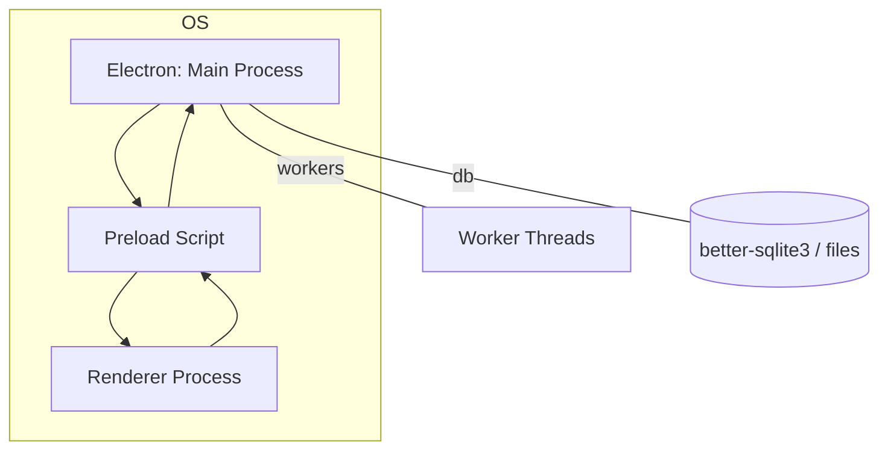
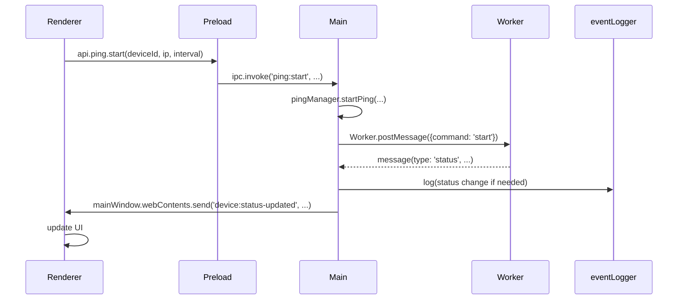
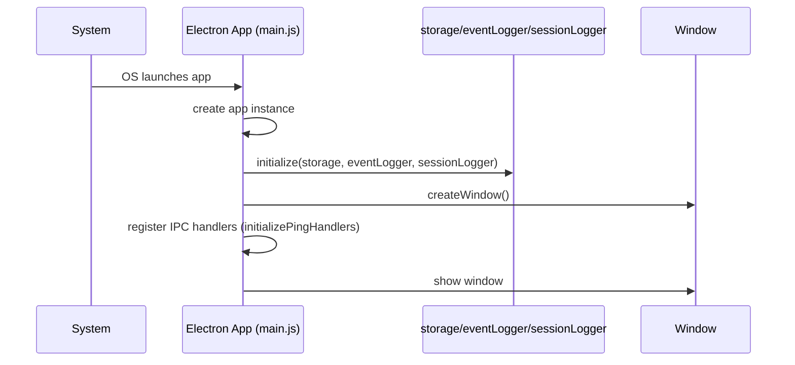

# Heartbeater Architecture

This document describes the high-level architecture of the Heartbeater application, module boundaries, process interactions, data flows, and guidance for testing and rollback. Diagrams are provided as Mermaid graphs for visualization.

## Overview

Heartbeater is an Electron-based desktop application split into three runtime contexts:

- Main process: application bootstrap, window lifecycle, IPC handlers, persistent storage, worker orchestration, and event logging.
- Preload script: secure context bridge exposing limited APIs to the renderer.
- Renderer process: UI, user interactions and calls to the preload APIs.

Key design goals:

- Single Responsibility: small modules with clear responsibilities.
- Testability: avoid import-time side-effects; modules that touch native resources expose `initialize(app)`.
- Observability: centralized time and logging utilities and an `eventLogger` for persistent events.

## Process Diagram



## Module Boundaries (Main process)

- `main.js` — minimal bootstrap: calls initialize on storage, eventLogger, sessionLogger, creates window and registers IPC handlers.
- `appLifecycle.js` — app-level events and lifecycle wiring.
- `window.js` — Electron BrowserWindow creation.
- `logger.js` — console logging wrapper using `nowIso()` and `formatMessage()`.
- `timeUtils.js` — `nowIso()`, `toIso8601()`, `formatLocal()`, `parseIso()`.
- `loggingUtils.js` — contextual log formatting helpers.
- `storage.js` — JSON-based group/device storage; `initialize(app)` to set paths.
- `eventLogger.js` — persistent event DB (better-sqlite3) with ISO timestamps and query APIs; explicit `initialize(app)`.
- `sessionLogger.js` — time-series session DBs per group; explicit `initialize(app)`.
- `pingWorkerManager.js` — worker orchestration for pinging devices (start/stop/metrics).
- `pingWorker.js` — worker thread code that performs pings and emits messages.
- `pingManager.js` — facade that delegates to `pingWorkerManager` (public API used by IPC handlers).
- `ipc*.js` — modules that register IPC handlers (e.g. `ipcPingHandlers.js`) via `initializeXHandlers(window)`.

## IPC & Data Flow

Renderer <-> Preload <-> Main is the canonical flow.

1. Renderer calls `window.api.*` exposed by the preload script.
2. Preload forwards to `ipcRenderer.invoke()` which reaches `ipcMain.handle()` handlers in main.
3. Handlers use `pingManager`, `storage`, `eventLogger`, etc., and return results to the renderer.

Mermaid sequence for a ping start and status update:



## Event Logging

- All persisted events use ISO8601 timestamps (`nowIso()`).
- `eventLogger` stores events in a SQLite DB (`events.db`) and provides query APIs:
  - `queryByTimeInterval(startIso, endIso)`
  - `queryByGroup(groupId, startIso, endIso)`
  - `getRecentEvents(limit)`
  - `pruneEvents(olderThanIso)`

Example event payload fields:

- `id`, `timestamp` (ISO8601), `level`, `category`, `eventType`, `message`, `deviceId`, `deviceIp`, `groupId`, `groupName`, `source`, `metadata` (JSON)

## Worker Model

- Workers run `pingWorker.js` and post messages to the main thread.
- `pingWorkerManager` tracks workers in a Map keyed by `deviceId` and maintains per-worker `state` containing metrics and last status.
- Worker messages include: `started`, `stopped`, `status`, `log_attempt`, `full-status`.

Worker lifecycle responsibilities:

- spawn Worker with path `pingWorker.js`
- attach `on('message')`, `on('error')`, `on('exit')`
- postMessage to start/stop
- aggregate metrics into `state.lastStatusUpdate`

## Initialization & Testing Patterns

- Avoid import-time side-effects: modules that access `app.getPath()` or open DB files expose `initialize(app)`.
- `main.js` should call `initialize(app)` after `app.whenReady()` and before spawning workers or registering IPC handlers that rely on those modules.

Testing guidance:

- Unit tests should mock native modules (`worker_threads`, `better-sqlite3`, and `electron.app/ipcMain`) at the top of the test file before importing the module under test.
- Use `jest.doMock` or top-level `jest.mock` to ensure mocks are active during module import.
- Use small, focused tests for `pingWorkerManager`, `ipcPingHandlers`, `timeUtils`, `loggingUtils`, and `eventLogger` (with a mock DB constructor).

## Data Persistence

- `storage.js` persists devices and groups as JSON files in the app data path.
- `eventLogger` and `sessionLogger` use `better-sqlite3` for time-series and event data. Schema decisions:

```sql
-- events table (simplified)
CREATE TABLE IF NOT EXISTS events (
  id INTEGER PRIMARY KEY AUTOINCREMENT,
  timestamp TEXT NOT NULL,
  level TEXT,
  category TEXT,
  eventType TEXT,
  message TEXT,
  deviceId TEXT,
  deviceIp TEXT,
  groupId TEXT,
  groupName TEXT,
  source TEXT,
  metadata TEXT
);
```

Session DBs have a compact schema for ping samples (timestamp, responseTime, success/failure, sequence counters).

## Operational Considerations

- Worker resource limits: when running many concurrent pings, limit worker count or use a pooled approach.
- DB file rotation & pruning: `eventLogger.pruneEvents()` should be scheduled if the DB grows large.
- Backups: export `events.db` and session DBs for archival.

## Security

- Preload exposes a minimal, explicitly-curated API surface — never expose `require` directly.
- Validate and sanitize any renderer-supplied inputs in the main process before touching disk or spawning workers.

## Rollback & Recovery

If a change introduces regressions:

1. Use `git revert` / `git reset` to return to a known-good commit.
2. Restore DB backups if a schema change was applied.
3. Re-enable previous initialization behaviour (remove `initialize(app)` calls) until modules are patched.

## Appendix: Detailed Startup Sequence



---

This document is intended to be a living reference. If you want, I can also produce a printable PDF or a visual diagram file (SVG) exported from Mermaid. Tell me which formats or additional details you'd like included.
